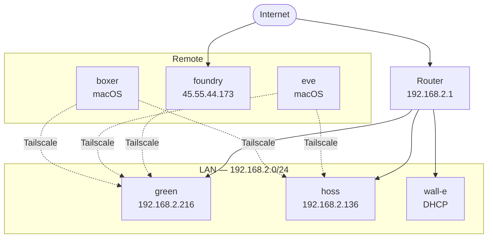
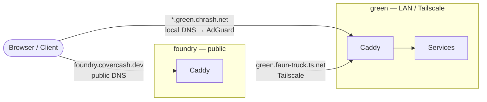
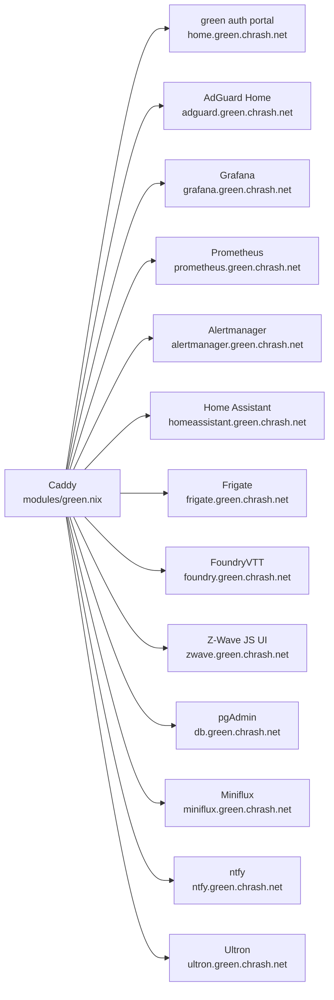
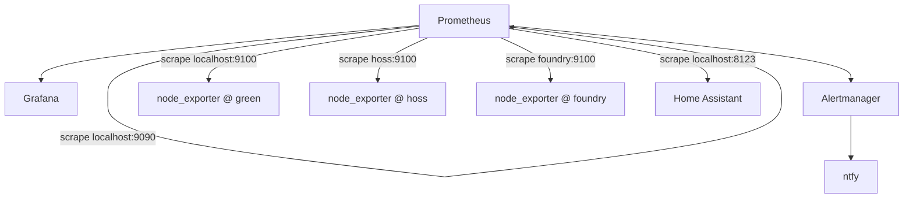
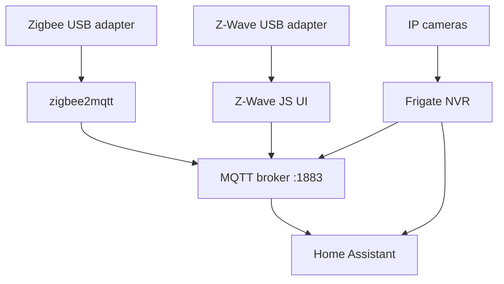

# Network Topology

## Machines

| Host | Role | Config |
|------|------|--------|
| `eve` | Personal MacBook — primary workstation | [`flake.nix` → `homeConfigurations.eve`](../flake.nix) |
| `boxer` | Work MacBook (Walmart) | [`flake.nix` → `homeConfigurations.boxer`](../flake.nix) |
| `green` | Homelab server — 16 GB RAM, GTX 1060 | [`modules/green.nix`](../modules/green.nix) |
| `hoss` | Workstation / build machine — 64 GB RAM, RTX 4090 | [`modules/hoss.nix`](../modules/hoss.nix) |
| `wall-e` | Desktop | [`modules/wall-e.nix`](../modules/wall-e.nix) |
| `foundry` | VPS (Digital Ocean) — public ingress, DNS replica | [`modules/foundry.nix`](../modules/foundry.nix) |
| `rescue-disk` | Bootable recovery ISO | [`rescue-disk.nix`](../rescue-disk.nix) |

`eve` and `boxer` are macOS with standalone home-manager — no NixOS.
All NixOS machines share [`configuration.nix`](../configuration.nix) as a base.

---

## Physical network

`hoss` has Wake-on-LAN enabled on `enp5s0`. `green` has a JetKVM attached for
out-of-band console access. `hoss` has no out-of-band management.

---

## Traffic ingress

`foundry` acts as a public-facing reverse proxy — it forwards to `green` over
Tailscale. Internal clients reach `green` directly via AdGuard DNS.
See [`modules/foundry.nix`](../modules/foundry.nix) and [`modules/green.nix`](../modules/green.nix).

---

## green — services

All services are proxied by Caddy with TLS from the shared homelab CA.
Routes are declared in [`modules/green.nix`](../modules/green.nix) under `services.green.routes`.

---

## Monitoring

Defined in [`modules/green.nix`](../modules/green.nix).

node_exporter runs as a Podman container on each machine.
See `oci-containers.containers.node_exporter` in each host's module.

---

## IoT / home automation

Defined in [`modules/green.nix`](../modules/green.nix), [`modules/zigbee_receiver.nix`](../modules/zigbee_receiver.nix), [`modules/z-wave_receiver.nix`](../modules/z-wave_receiver.nix).

---

## DNS and TLS

- **Primary DNS**: AdGuard Home on `green` — [`modules/adguard.nix`](../modules/adguard.nix)
- **DNS replica**: AdGuard on `foundry`, synced from `green` — [`modules/adguardhome-sync.nix`](../modules/adguardhome-sync.nix), [`modules/adguard-replica.nix`](../modules/adguard-replica.nix)
- **Internal CA**: `certs/ca.pem` distributed to all machines via `security.pki.certificates` — [`modules/shared-ca.nix`](../modules/shared-ca.nix)
- **Cert issuance**: `mkcert-shared` auto-issues certs per-machine — [`modules/certificates.nix`](../modules/certificates.nix)

---

## Nix build infrastructure

`hoss` is a trusted remote builder — other machines can offload heavy builds to it.
Setup: [`modules/hoss-builder.nix`](../modules/hoss-builder.nix).
Public signing key registered in [`configuration.nix`](../configuration.nix) under `extra-trusted-public-keys`.
