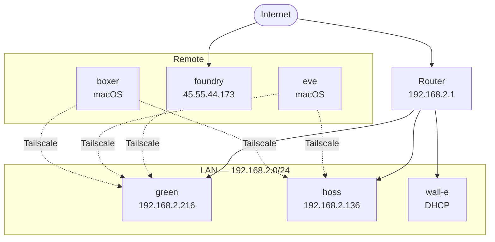
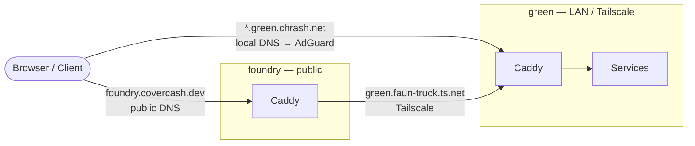
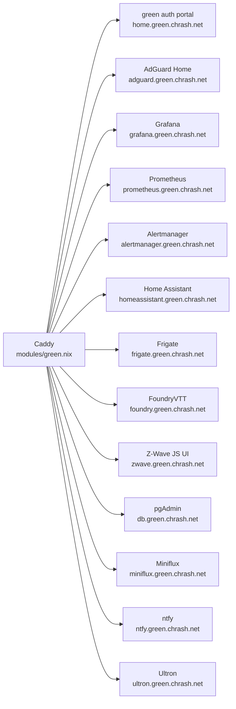
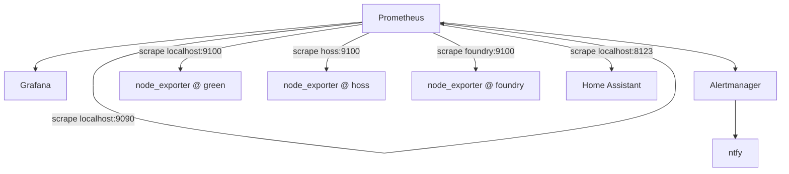
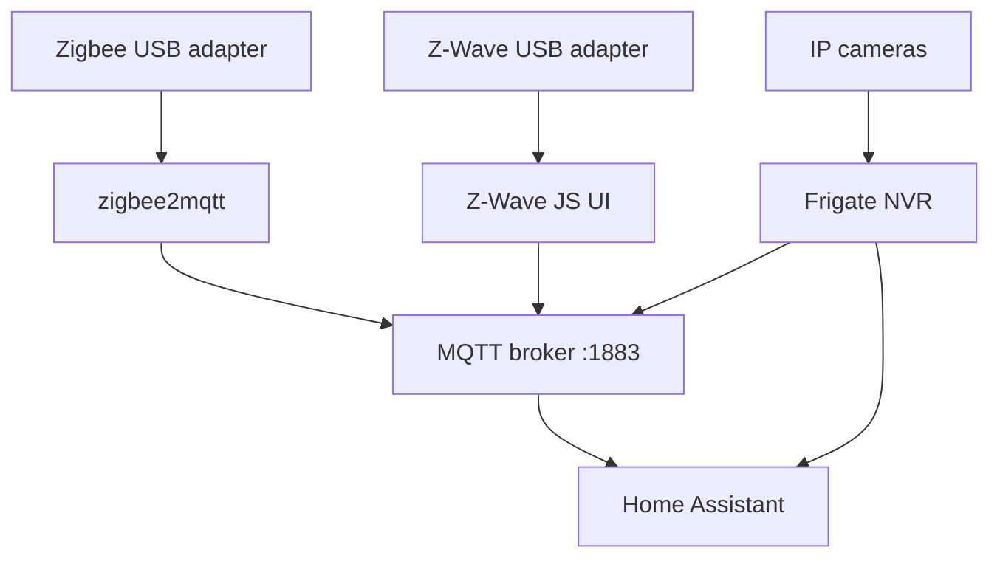

# network topology

## machines

| Host | Role | Config |
|------|------|--------|
| `eve` | personal MacBook — primary workstation | [`flake.nix` → `homeConfigurations.eve`](../flake.nix) |
| `boxer` | work MacBook (Walmart) | [`flake.nix` → `homeConfigurations.boxer`](../flake.nix) |
| `green` | homelab server — 16 GB RAM, GTX 1060 | [`modules/green.nix`](../modules/green.nix) |
| `hoss` | workstation / build machine — 64 GB RAM, RTX 4090 | [`modules/hoss.nix`](../modules/hoss.nix) |
| `wall-e` | desktop | [`modules/wall-e.nix`](../modules/wall-e.nix) |
| `foundry` | VPS (Digital Ocean) — public ingress, DNS replica | [`modules/foundry.nix`](../modules/foundry.nix) |
| `rescue-disk` | bootable recovery ISO | [`rescue-disk.nix`](../rescue-disk.nix) |

`eve` and `boxer` are macOS with standalone home-manager — no NixOS.
all NixOS machines share [`configuration.nix`](../configuration.nix) as a base.

---

## physical network

```mermaid
graph TD
    internet([Internet])
    router[Router\n192.168.2.1]

    subgraph lan[LAN — 192.168.2.0/24]
        green[green\n192.168.2.216]
        hoss[hoss\n192.168.2.136]
        walle[wall-e\nDHCP]
    end

    subgraph remote[Remote]
        foundry[foundry\n45.55.44.173]
        eve[eve\nmacOS]
        boxer[boxer\nmacOS]
    end

    internet --> router
    router --> green & hoss & walle
    internet --> foundry

    foundry -. Tailscale .-> green
    eve -. Tailscale .-> green & hoss
    boxer -. Tailscale .-> green & hoss
```

`hoss` has Wake-on-LAN enabled on `enp5s0`. `green` has a JetKVM attached for
out-of-band console access. `hoss` has no out-of-band management.

---

## traffic ingress

```mermaid
graph LR
    browser([Browser / Client])

    subgraph foundry_node[foundry — public]
        fcaddy[Caddy]
    end

    subgraph green_node[green — LAN / Tailscale]
        gcaddy[Caddy]
        services[Services]
    end

    browser -->|foundry.covercash.dev\npublic DNS| fcaddy
    browser -->|"*.green.chrash.net\nlocal DNS → AdGuard"| gcaddy
    fcaddy -->|"green.faun-truck.ts.net\nTailscale"| gcaddy
    gcaddy --> services
```

`foundry` acts as a public-facing reverse proxy — it forwards to `green` over
Tailscale. internal clients reach `green` directly via AdGuard DNS.
see [`modules/foundry.nix`](../modules/foundry.nix) and [`modules/green.nix`](../modules/green.nix).

---

## green — services

all services are proxied by Caddy with TLS from the shared homelab CA.
routes are declared in [`modules/green.nix`](../modules/green.nix) under `services.green.routes`.

```mermaid
graph LR
    caddy[Caddy\nmodules/green.nix]

    caddy --> portal[green auth portal\nhome.green.chrash.net]
    caddy --> adguard[AdGuard Home\nadguard.green.chrash.net]
    caddy --> grafana[Grafana\ngrafana.green.chrash.net]
    caddy --> prometheus[Prometheus\nprometheus.green.chrash.net]
    caddy --> alertmanager[Alertmanager\nalertmanager.green.chrash.net]
    caddy --> ha[Home Assistant\nhomeassistant.green.chrash.net]
    caddy --> frigate[Frigate\nfrigate.green.chrash.net]
    caddy --> foundry_vtt[FoundryVTT\nfoundry.green.chrash.net]
    caddy --> zwave[Z-Wave JS UI\nzwave.green.chrash.net]
    caddy --> pgadmin[pgAdmin\ndb.green.chrash.net]
    caddy --> miniflux[Miniflux\nminiflux.green.chrash.net]
    caddy --> ntfy[ntfy\nntfy.green.chrash.net]
    caddy --> ultron[Ultron\nultron.green.chrash.net]
```

---

## monitoring

defined in [`modules/green.nix`](../modules/green.nix).

```mermaid
graph TD
    prom[Prometheus]
    grafana[Grafana]
    am[Alertmanager]
    ntfy[ntfy]

    prom -->|scrape localhost:9090| prom
    prom -->|scrape localhost:9100| green_ne[node_exporter @ green]
    prom -->|scrape hoss:9100| hoss_ne[node_exporter @ hoss]
    prom -->|scrape foundry:9100| foundry_ne[node_exporter @ foundry]
    prom -->|scrape localhost:8123| ha[Home Assistant]

    prom --> am --> ntfy
    prom --> grafana
```

node_exporter runs as a Podman container on each machine.
see `oci-containers.containers.node_exporter` in each host's module.

---

## iot / home automation

defined in [`modules/green.nix`](../modules/green.nix), [`modules/zigbee_receiver.nix`](../modules/zigbee_receiver.nix), [`modules/z-wave_receiver.nix`](../modules/z-wave_receiver.nix).

```mermaid
graph TD
    zigbee[Zigbee USB adapter]
    zwave[Z-Wave USB adapter]
    z2m[zigbee2mqtt]
    zwavejs[Z-Wave JS UI]
    mqtt[MQTT broker :1883]
    ha[Home Assistant]
    frigate[Frigate NVR]
    cameras[IP cameras]

    zigbee --> z2m --> mqtt
    zwave --> zwavejs --> mqtt
    cameras --> frigate --> mqtt
    mqtt --> ha
    frigate --> ha
```

---

## DNS and TLS

- **primary DNS**: AdGuard Home on `green` — [`modules/adguard.nix`](../modules/adguard.nix)
- **DNS replica**: AdGuard on `foundry`, synced from `green` — [`modules/adguardhome-sync.nix`](../modules/adguardhome-sync.nix), [`modules/adguard-replica.nix`](../modules/adguard-replica.nix)
- **internal CA**: `certs/ca.pem` distributed to all machines via `security.pki.certificates` — [`modules/shared-ca.nix`](../modules/shared-ca.nix)
- **cert issuance**: `mkcert-shared` auto-issues certs per-machine — [`modules/certificates.nix`](../modules/certificates.nix)

---

## nix build infrastructure

`hoss` is a trusted remote builder — other machines can offload heavy builds to it.
setup: [`modules/hoss-builder.nix`](../modules/hoss-builder.nix).
public signing key registered in [`configuration.nix`](../configuration.nix) under `extra-trusted-public-keys`.
